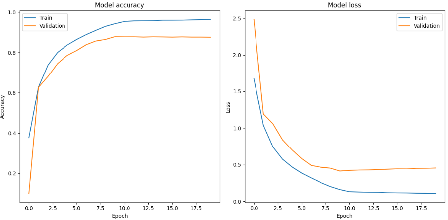

# EfficientNet
EfficientNet is a family of convolutional neural networks (CNNs) introduced by Google AI that have achieved state-of-the-art performance on various image recognition and computer vision tasks. The key innovation behind EfficientNet is the application of compound scaling to balance network depth, width, and resolution. This approach allows EfficientNet models to achieve better accuracy and efficiency compared to traditional CNN architectures.

  <strong>Fig.1 Proposed compound scaling idea by the EfficientNet paper</strong> 
  

## Implementation
This repository contains a from scratch implementation of the EfficientNet model with Squeeze-and-Excitation and MBConv blocks with skip connections. Recreated model has 5,288,548, which matches the original implementation (~5,3m) and the EfficientNetB0 from `keras.applications`.

## Testing the model
To verify the solidity of the implementation the model was trained on the **CIFAR10 dataset from sratch** with a Cosine Decay Learning rate schedule, for 50 epochs with Early stopping.

**Fig.2 Training Losses**

### Evaluation on test set
| Dataset   | Accuracy (%) | Epoch |
|-----------|--------------|-------|
| CIFAR-10  | 89           | 31    |

## Some Predictions
**NOTE**: Images are blurred as they are rescaled from the original 32x32 dimensions of the CIFAR-10 dataset.

**Fig.3 Predictions on the test set**

# References
[EfficientNet: Rethinking Model Scaling for Convolutional Neural Networks](https://arxiv.org/abs/1905.11946)

