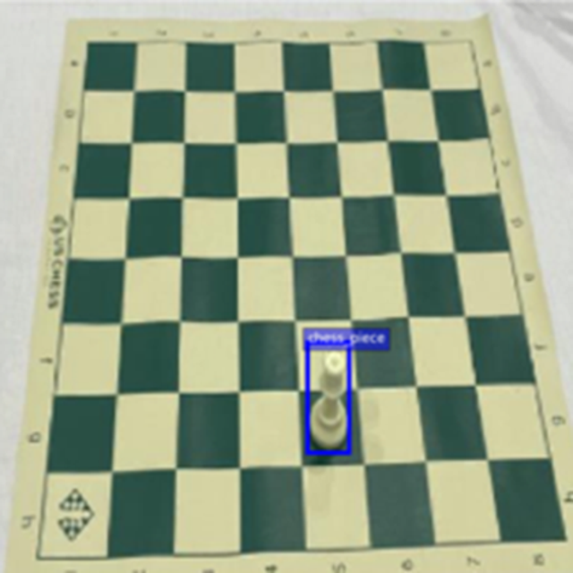
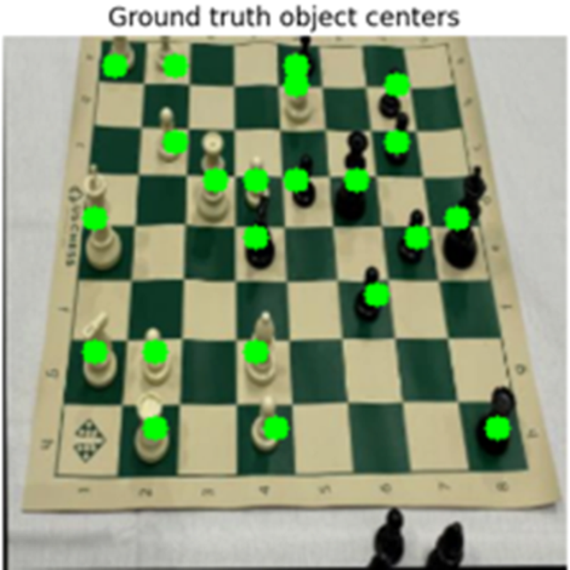
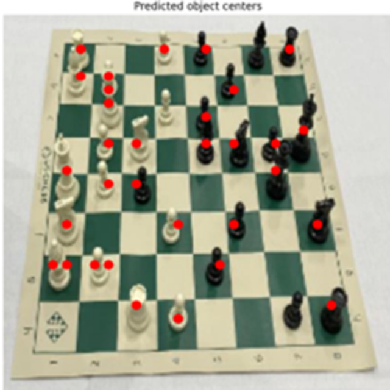

# FOMO (Fewer Objects, More Objects)
FOMO (Faster Objects, More Objects), introduced by [Edge Impulse](https://docs.edgeimpulse.com/docs/edge-impulse-studio/learning-blocks/object-detection/fomo-object-detection-for-constrained-devices), is an innovative machine learning algorithm designed for object detection on highly constrained devices. It enables real-time detection, counting, and localization of multiple objects in an image using up to 30x less processing power and memory compared to more traditional models like MobileNet SSD or YOLOv5.

While the underlying architecture of FOMO is based on the BNN (Binary Neural Network) developed by [Mat Palm](https://matpalm.com/blog/counting_bees/), Edge Impulse made this architecture more accessible and widely known by rebranding it as FOMO. They optimized it specifically for edge devices and integrated it into their platform, making it popular in applications requiring low-latency object detection on hardware with limited resources.

## Object detection without anchors
This lightning-fast model offers a unique approach to object detection by eliminating the need for traditional bounding boxes and anchor boxes. Unlike conventional models that require predefined anchor boxes to localize objects, this architecture focuses on detecting the presence of objects and their locations in a grid-based format, which drastically simplifies the object detection process. By doing so, it effectively solves simple object detection problems with significantly reduced computational overhead, making it ideal for real-time applications on resource-constrained devices. This streamlined approach boosts speed and efficiency while still delivering reliable detection.

## Experiment results on the chess dataset
For this experiment, we utilized the [chess pieces dataset](https://public.roboflow.com/object-detection/chess-full/) from Roboflow, which contains labeled images of all chess pieces on a chessboard. Our goal was to detect all chess pieces on the board using the FOMO model, focusing on both piece identification and localization.

    
    
<strong>Fig. 1:</strong> Sample from dataset

The first step was to convert bounding box style annotations to an object centroids representation in a 28x28 downlsampled grid.

    
    
<strong>Fig. 2:</strong> Conversion to centroid grid-styled representation

## Results
After training this simplistic model with a pre-trained MobilenetV2 backbone we get pretty impresive results considering the lightweight nature of the model.

    
    
<strong>Fig. 3:</strong> FOMO Object Detection predictions

