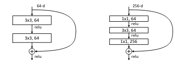
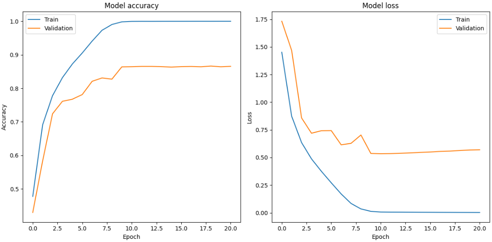

# ResNet
ResNet, short for Residual Networks, was introduced by Kaiming He et al. in their 2015 paper "Deep Residual Learning for Image Recognition". This innovative architecture addresses the problem of vanishing gradients in deep neural networks by utilizing identity shortcut connections, allowing for the construction of much deeper networks without performance degradation.

  <strong>Fig.1 Convolutional block with skip connections</strong> 
  

## Implementation
This repository contains a from scratch implementation of the Resnet18 model. Recreated model has 11,223,370 trainable parameters. By adding the right number of building blocks from the paper you can adjust it to create any ResNet variant.

## Testing the model
To verify the solidity of the implementation the model was trained on the **CIFAR10 dataset from sratch** with a Cosine Decay Learning rate schedule, for 50 epochs with Early stopping. No augmentations were used in this training experiment.

**Fig.2 Training Losses**

### Evaluation on test set
| Dataset   | Accuracy (%) | Epoch |
|-----------|--------------|-------|
| CIFAR-10  | 86           | 21    |

## Some Predictions
**NOTE**: Images are blurred as they are rescaled from the original 32x32 dimensions of the CIFAR-10 dataset.

**Fig.3 Predictions on the test set**

# References
[Deep Residual Learning for Image Recognition](https://arxiv.org/abs/1512.03385)

