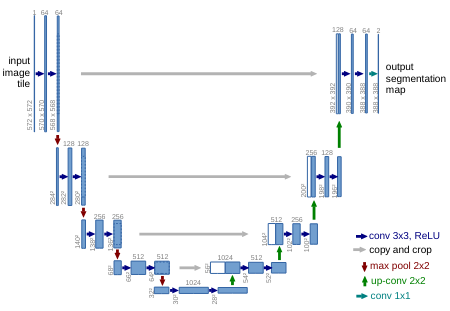
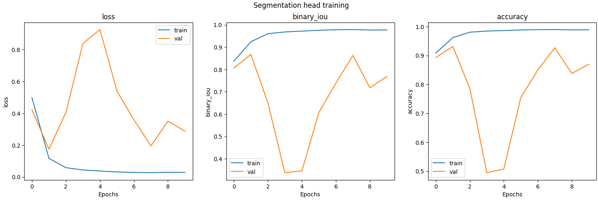
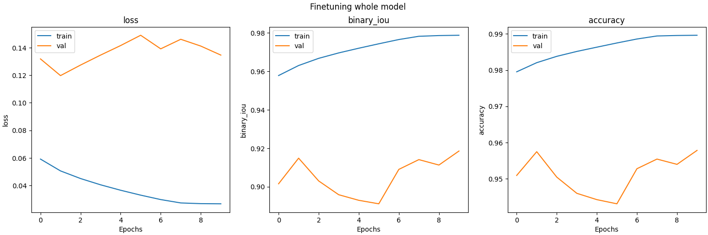
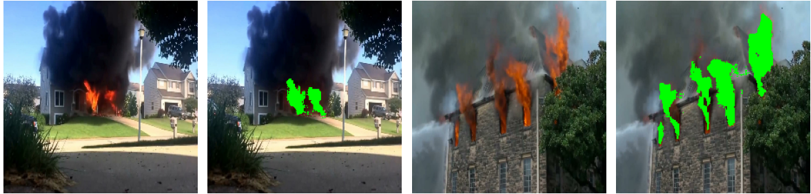
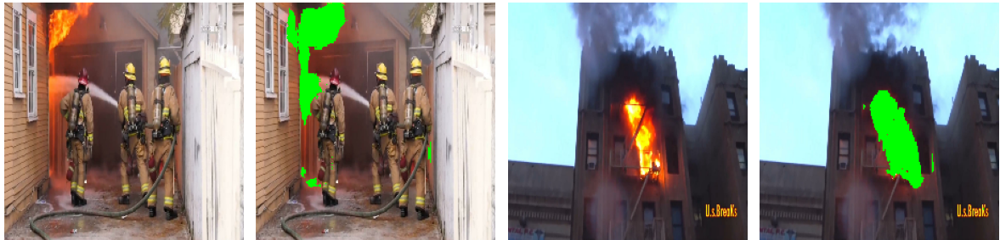

# U-Net
U-Net is a convolutional neural network architecture tailored for image segmentation tasks, renowned for its effectiveness in tasks requiring precise pixel-level localization. The architecture features:

- Contracting Path (Encoder): This path captures context by applying convolutional and pooling layers to progressively reduce spatial dimensions while increasing feature depth. This enables the network to learn hierarchical representations of input images.

- Expanding Path (Decoder): The expanding path employs transposed convolutions to upsample feature maps back to the original image resolution. Skip connections concatenate feature maps from the contracting path to the decoder, facilitating precise localization and maintaining fine-grained details.

  <em>Fig. 1 U-net Architecture</em> 
  

## Implementation
This repository contains a from scratch implementation of the U-net model with a pre-trained MobilenetV2 backbone from Keras official.

## Testing the model
To verify the solidity of the implementation the model was trained on the **Fire Seg** dataset, with a pre-trained MobilenetV2 backbone,
for 25 epochs with Early stopping. Additionally, the full model was finetuned for 10 more epochs. Some simple augmentations with KerasCV
were also used.

*Fig.2 Training Losses*

*Fig.2 Finetuning Losses*

### Evaluation on test set
| Dataset   | Accuracy (%) | Accuracy (%)  | Epoch |
|-----------|--------------|-------|---------------|
| Fire Dataset  | 93       | 88    |         25    |

## Some Predictions
*Fig.3 Segmentation results on the test set*

# References
[U-Net: Convolutional Networks for Biomedical Image Segmentation](https://arxiv.org/abs/1505.04597v1)

[FireSeg dataset](https://github.com/hayatkhan8660-maker/Fire_Seg_Dataset)

