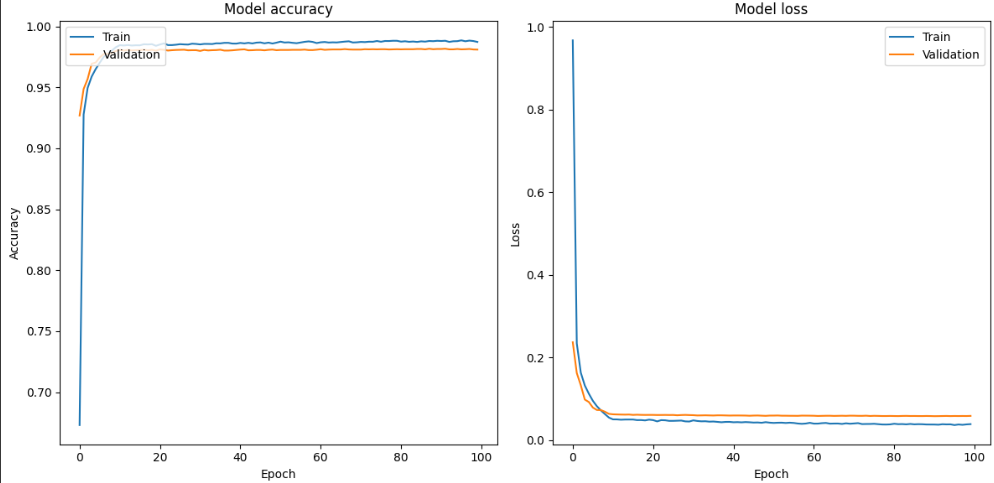
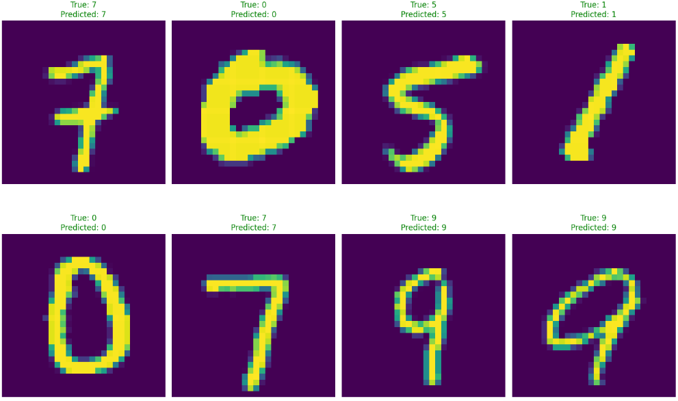

# Vision Transformer
Vision Transformer (ViT) is a novel image classification model that leverages the transformer architecture, originally designed for natural language processing. ViT splits an image into a sequence of patches and processes them as tokens, similar to words in a sentence. This approach enables ViT to capture global dependencies efficiently, leading to state-of-the-art performance on various image recognition tasks.

*Fig.1 Vision Transformer (ViT) architecture*

## Implementation
This repository contains a from scratch implementation of the ViT model which can be configured to any variant of the model. Recreated model (ViT-B16) matches the original ~86 million parameters from the paper.

## Testing the model
To verify the solidity of the implementation the model was trained on the **MNIST dataset from sratch** with a Cosine Decay Learning rate schedule, for 100 epochs with Early stopping.

*Fig.2 Training Losses*

| Dataset   | Accuracy (%) | Epoch |
|-----------|--------------|-------|
| MNIST  | 98           | 100    |

## Some Predictions

*Fig.3 Predictions on the test set*

# References
[An Image is Worth 16x16 Words: Transformers for Image Recognition at Scale
](https://arxiv.org/abs/2010.11929)

